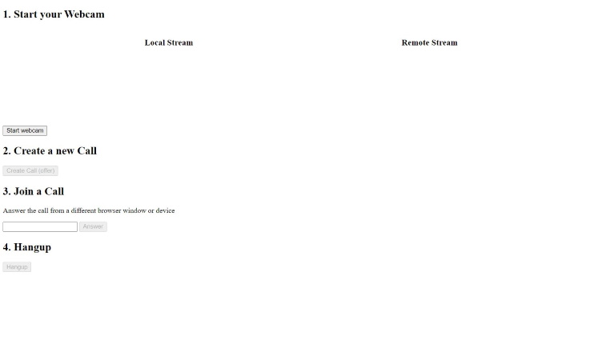
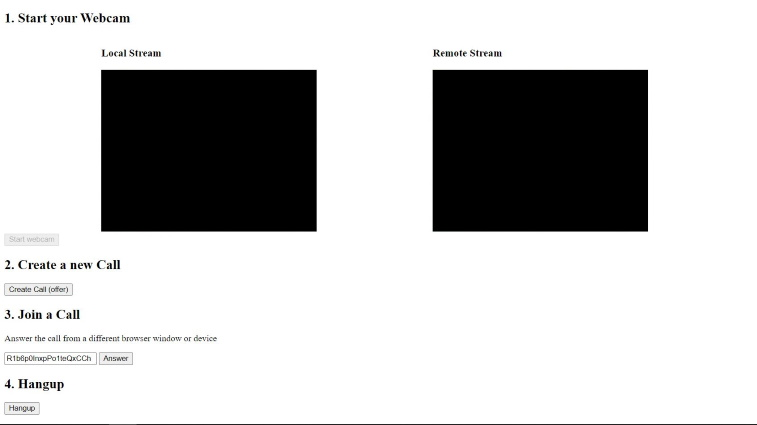

# [video chat](https://project-demos-6c9d7.web.app/)

A basic video chat app. Built by following [Fireship](https://www.youtube.com/channel/UCsBjURrPoezykLs9EqgamOA)'s [WebRTC in 100 Seconds video](https://www.youtube.com/watch?v=WmR9IMUD_CY&ab_channel=Fireship). 

Created to get a better understanding of [WebRTC](https://webrtc.org/) for future projects.

# Screenshots

  
  

# Technology

Created with WebRTC, JavaScript, and Firebase.